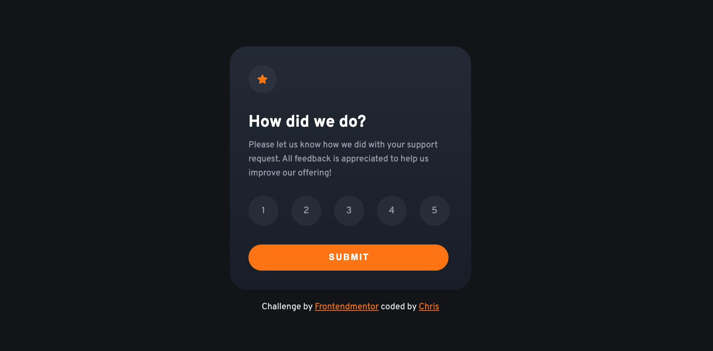

# Frontend Mentor - Interactive rating component solution

This is a solution to the [Interactive rating component challenge on Frontend Mentor](https://www.frontendmentor.io/challenges/interactive-rating-component-koxpeBUmI). Frontend Mentor challenges help you improve your coding skills by building realistic projects.

## Table of contents

- [Overview](#overview)
  - [The challenge](#the-challenge)
  - [Screenshot](#screenshot)
  - [Links](#links)
- [My process](#my-process)
  - [Built with](#built-with)
  - [What I learned](#what-i-learned)
  - [Continued development](#continued-development)
  - [Useful resources](#useful-resources)
- [Author](#author)
- [Acknowledgments](#acknowledgments)

## Overview

### The challenge 💪

Users should be able to:

- View the optimal layout for the app depending on their device's screen size
- See hover states for all interactive elements on the page
- Select and submit a number rating
- See the "Thank you" card state after submitting a rating
- User can not commit without selecting a rating

### Screenshot 📷

### Links 🌐

- Solution URL: https://github.com/Chris-2811/interactive-rating-component.git
- Live Site URL: https://chris-2811.github.io/interactive-rating-component/

## My process

### Built with 🚀

- Semantic HTML5 markup
- CSS custom properties
- Flexbox
- JavaScript

### What I learned

In this JavaScript code, I learned how to:

- Use the forEach() method to iterate over a collection of elements and attach event listeners to each one.

- Use the getAttribute() method to get the value of a custom attribute on an HTML element.

- Use the async and await keywords to handle asynchronous operations with Promises.

- Use conditional statements (if/else) to control the flow of program execution based on specific conditions.

- Use the setTimeout() method to delay the execution of a function by a specified amount of time.

### Continued development

In my next projects I want to focus more on JavaScript 🔥

## Author &#x1F468

- Github - [Christoph](https://github.com/Chris-2811)
- Frontend Mentor - [@Chris-2811](https://www.frontendmentor.io/profile/yourusername)
